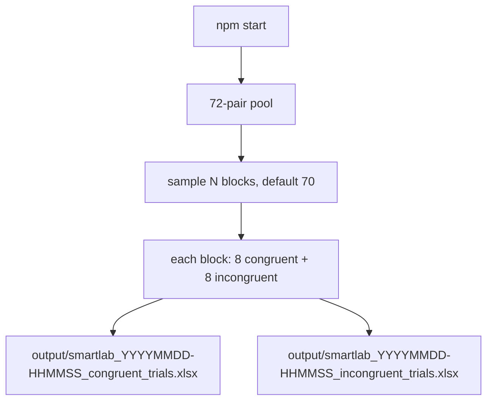
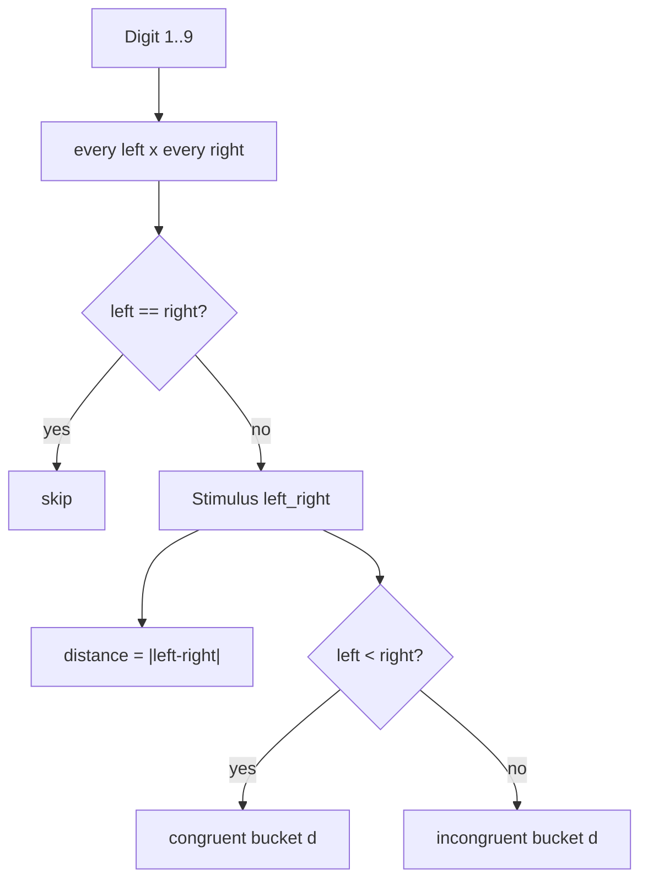
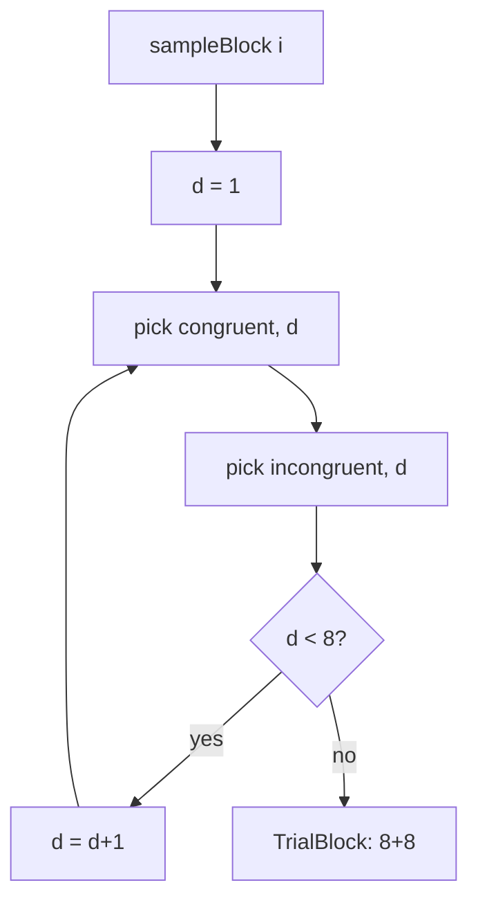
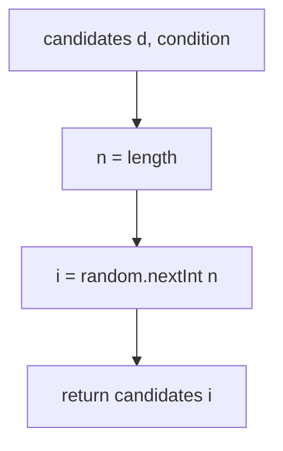
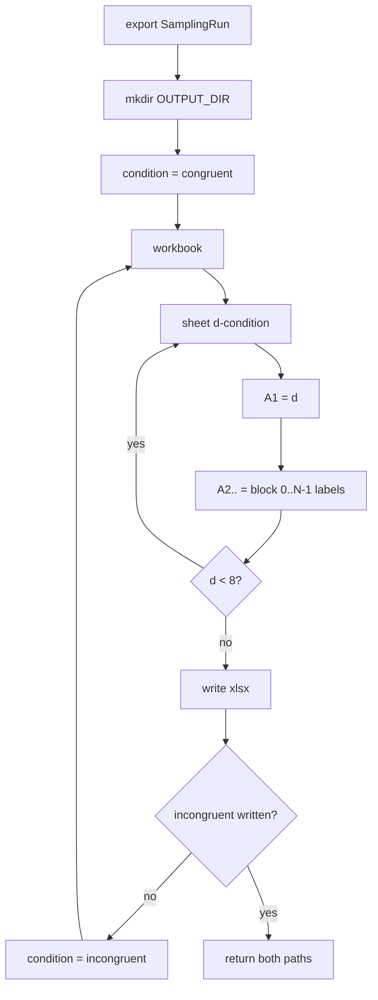

# How it works

How the pool is built, what one block draws, and where those values land in Excel.

## End to end

After ZIP or clone: `npm install`, then `npm start`.

`ITERATIONS` defaults to 70. `OUTPUT_DIR` defaults to `output`. RNG is `crypto.randomInt`. Both files from one run share the same timestamp.

## Pool: 72 pairs

Example: `2_5` is d=3, congruent. `5_2` is d=3, incongruent. `1_1` is not in the pool.

Bucket size is `9-d`. Distance 8 has one pair: `1_9` / `9_1`.

## One block

`pick`:

`i` comes from `crypto.randomInt(0, n)`. Congruent and incongruent are separate calls. A pair is not tied to its reverse. The same pair can appear in a later block.

70 blocks means this loop runs 70 times. Those 70 labels are `A2`..`A71` on that sheet.

## Excel write

Same row number is the same block in both files. Sheet names: `1-congruent` .. `8-congruent` / `1-incongruent` .. `8-incongruent`.
